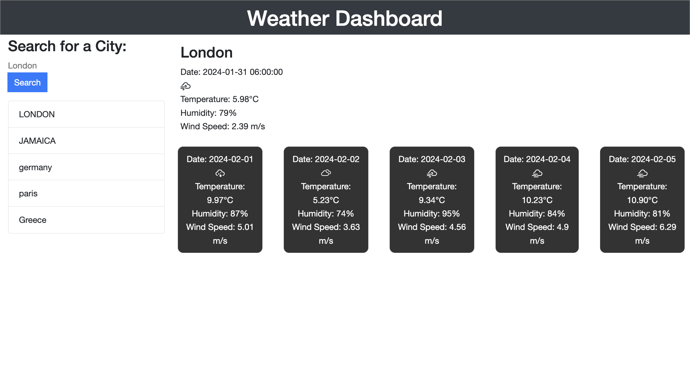

# Weather Dashboard

Welcome to the Weather Dashboard! This web application allows users to check the current weather and a 5-day forecast for a specified city. The application utilizes the OpenWeatherMap API to fetch weather data.

## Table of Contents

- [Features](#features)
- [Demo](https://toussaintphillips.github.io/Weather-Dashboard/)
- [Installation](#installation)
- [Usage](#usage)
- [Contributing](#contributing)
- [License](#license)
- [Contact](#contact)




## Features 

- **Current Weather:** Display real-time temperature, humidity, and wind speed for a chosen city.
- **5-Day Forecast:** Provide a 5-day forecast with temperature, humidity, and wind speed details.
- **Color-Coded Cards:** Weather condition-based color-coding for easy interpretation.
- **City History:** Keep a history of searched cities for quick access.

## Demo

Check out the live demo [here](#).

## Installation

To run the Weather Dashboard locally, follow these steps:

1. Clone the repository:

   ```bash
   git clone https://github.com/ToussaintPhillips/WeatherDashboard.git
   ```

2. Open the index.html file in your web browser.

## Usage

1. Enter the name of the city you want to check the weather for in the search bar.
2. Click the "Search" button.
3. View the current weather and 5-day forecast.

## Contributing

Contributions are welcome! If you have any improvements or suggestions, feel free to open an issue or create a pull request.

## License

This project is licensed under the [MIT License](LICENSE).

## Contact

For any inquiries or feedback, you can reach out to me:

- GitHub: [ToussaintPhillips](https://github.com/ToussaintPhillips)
- Email: [toussaintphillips@gmail.com](toussaintphillips@gmail.com)

---

**Note:** Replace the placeholders with your actual information and update the links accordingly.
```
